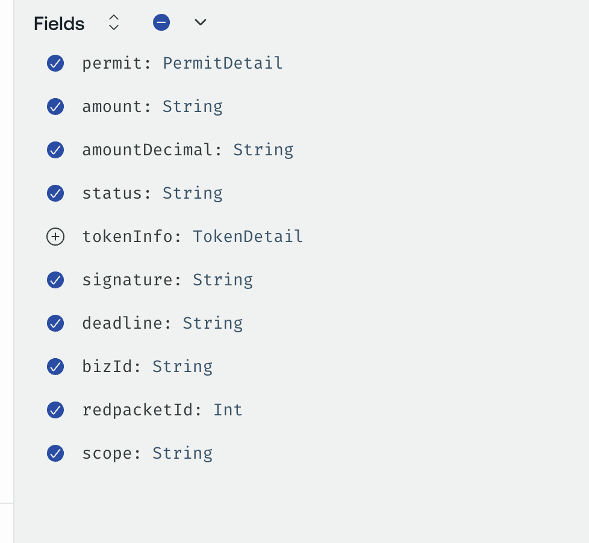
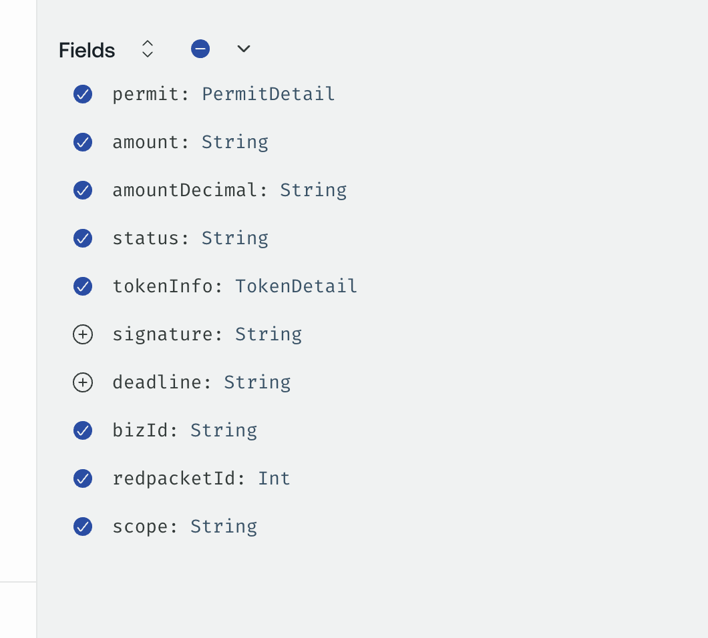
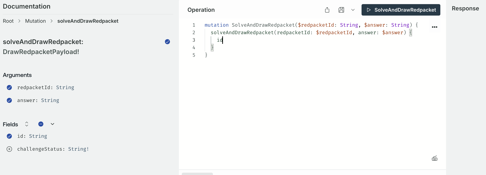
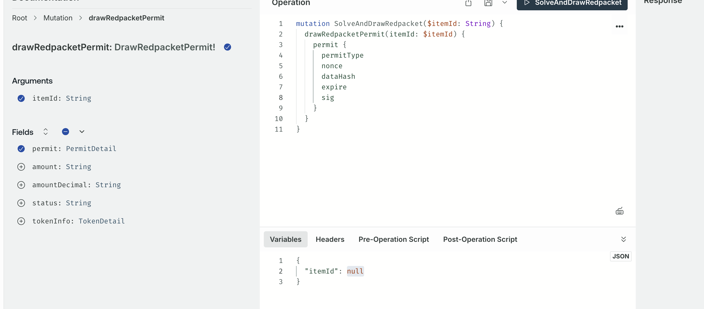

# redpacket-server

`redpacket-server` 用于生成红包（Redpacket），并支持与 **Agent / NFT / Permit / 合约** 的联动。当前支持三种红包生成场景：

1. 同时生成 Agent + 红包
2. 单独生成红包
3. 单独生成新人红包

---

## 通用说明

### 基本概念


| 字段          | 说明                                   |
| --------------- | ---------------------------------------- |
| bizType       | 业务类型，当前固定为`redpacket_nft`    |
| itemNum       | 红包数量                               |
| totalAmount   | 红包总金额（单位：wei，字符串）        |
| permit        | 后端生成的签名结构，用于合约校验       |
| redpacketId   | 服务端生成的红包业务 ID                |
| bizId / nftId | NFT ID（与 bizId 等同）                |
| scope         | 红包作用范围（由服务端返回，透传即可） |

---

## 场景一：同时生成 Agent + 红包

### Step 1：生成 Permit + Agent 信息

**接口**
`GenerateRedpacketPermitAndAgent`

**请求参数**

{
"input": {
"bizType": "redpacket_nft",
"itemNum": 3,
"totalAmount": "100000000000000000",
"agentName": "jim_agent_2",
"desc": "hahahahaha",
"imageId": "xxxx"
}
}
返回结果
返回内容中包含以下关键字段：

bizId（后续作为 nftId 使用）

permit

redpacketId

signature

nftDeadline

scope

Step 2：调用合约创建红包并 Mint Agent NFT
合约方法

solidity
复制代码
generateRedpacketAndMintNft(
uint256 nftId,
uint256 amount,
uint256 count,
address currencyToken,
Permit permit,
uint256 startAt,
uint256 endAt,
uint256 redpacketId,
bytes signature,
uint256 nftDeadline
)
JS 调用示例（Hardhat / Ethers）

ts
复制代码
const currencyAmount = ethers.parseEther("0.1");

const token = await ethers.getContractAt("IERC20", metisAddress);
await token.connect(signers[0]).approve(
redpacketFactoryAddress,
currencyAmount
);

await redpacketFactoryConnector.generateRedpacketAndMintNft(
"12",                      // nftId = bizId
currencyAmount,
3,
metisAddress,
permit,                    // Step1 返回的 permit
"1769673769",              // startAt
"1772274023",              // endAt
"10048",                   // redpacketId
signature,                 // Step1 返回
nftDeadline                // Step1 返回
);
参数说明

nftId：Step1 返回的 bizId

permit：Step1 返回

startAt / endAt：红包有效期（当前功能未启用，可设置为当前时间 ~ 当前时间 + 2 年）

redpacketId / signature / nftDeadline：均来自 Step1 返回

返回

合约返回红包地址（redpacketAddress）

Step 3：服务端生成红包记录
接口
GenerateRedpacket

请求参数

{
"input": {
"bizId": "12",
"bizType": "redpacket_nft",
"itemNum": 3,
"totalAmount": "100000000000000000",
"type": "mean",
"transactionHash": "0x92652c7386729099593ed86cb930ee22970b2ed562528c8f2c8120c09425e87c",
"address": "0xb15F59a178CCe1b6388bE6a8cf21029AE7631753",
"scope": "common"
}
}

## 场景二：单独生成红包（不生成 Agent / NFT）

### Step 1：生成红包 Permit

接口
GenerateRedpacketPermit

请求参数

{
"input": {
"bizId": null,
"bizType": "redpacket_nft",
"itemNum": null,
"totalAmount": null
}
}
返回

返回红包 permit

不包含 Agent / NFT 相关字段

Step 2：调用合约生成红包
合约方法

solidity
复制代码
generateRedpacket(...)
Step 3：服务端生成红包记录
与 场景一 Step 3 完全一致。

## 场景三：单独生成新人红包（Manager 发放）

### Step 1：生成新人红包 Permit

接口
GenerateNewOneRedpacketPermit

请求参数

{
"input": {
"bizId": "11",
"bizType": "redpacket_nft"
}
}

返回!
{
"data": {
"generateNewOneRedpacketPermit": {
"permit": {
"permitType": 1,
"nonce": "302375183540193242199992385907838937303",
"dataHash": "0x6d25f4912c5ad4452ff7539eb4beb95f6f41b8920978c9a5945a29ee8a3c1cd0",
"expire": "1769966512",
"sig": "0x029029f46231826a823451ef5b79159104771cdf6389b00fabe0ca636855cbb7210080ac7e04387dd7f4686107a896f9a86d29b7bfdd729f757e4aad55e3437c1b"
},
"amount": "100000000000000000",
"amountDecimal": "18",
"status": "live",
"bizId": null,
"redpacketId": null,
"scope": "newUser"
}
}
}

不包含 Agent / NFT 相关字段

不包含 redpacketId

Step 2：调用合约生成新人红包
合约方法

测试用例参考：

        const currencyAmount = ethers.parseEther("0.1");
        const rep = await redpacketFactoryConnector.generateRedpacketFromManager("11", currencyAmount, 3, metisAddress, "0xd4F8bbF9c0B8AFF6D76d2C5Fa4971a36fC9e4003",{
            permitType:"1",
            nonce:"302375183540193242199992385907838937303",
            dataHash:"0x6d25f4912c5ad4452ff7539eb4beb95f6f41b8920978c9a5945a29ee8a3c1cd0",
            expire:"1769966512",
            sig:"0x029029f46231826a823451ef5b79159104771cdf6389b00fabe0ca636855cbb7210080ac7e04387dd7f4686107a896f9a86d29b7bfdd729f757e4aad55e3437c1b"
        }, "1769673769", "1772274023");
        console.log("rep: " + JSON.stringify(rep));
generateRedpacketFromManager(...)

ps: 如果合约调用失败，前端需要调用一下newUserCancel接口，保证新用户可以重新从Step 1 开始操作

Step 3：服务端生成红包记录
与前两个场景一致。
请求与返回参考
input:
{
"input": {
"bizId": "11",
"bizType": "redpacket_nft",
"itemNum": 3,
"totalAmount": "100000000000000000",
"type": "mean",
"transactionHash": "0x49e0afedc21989b06101953539f21c8f010fbba51104e5e6294a87b6140588d2",
"address": "0x42eD80aeDc09001c9eAdc3c3d05e3EDfb2e58A47",
"scope": "newUser"
}
}

result:
{
"data": {
"generateRedpacket": {
"id": "9"
}
}
}

## 红包claim流程

### Step 1：调用solveAndDrawRedpacket接口


1.如果答题正确 会返回id，即后面步骤中的itemId（可以理解为已经领奖了，但是还没有claim）
2.如果答题错误 且还有机会 不会返回id，但会返回challengeStatus，值为in_progress
3.如果答题错误 且没有机会了 则会直接报错

### Step 2：调用drawRedpacketPermit接口获取领奖的permit


参数为1中返回的id
获取permit后，即可进行下一步调用合约领奖

### Step 3：调用合约draw方法领奖

参考测试代码：
###
const currencyAmount = ethers.parseEther("0.1");
const rep = await redpacketFactoryConnector.draw("12", "0xb15f59a178cce1b6388be6a8cf21029ae7631753", "33000000000000000", {
permitType:"2",
nonce:"209156988763131252863731905856698651909",
dataHash:"0x06fabb1c7fb6cd038cd8709af9b30766c0e47d887aa9bb5e3e276032055163fe",
expire:"1769684353",
sig:"0xa55b77d3564683843084f866c19ea9b277a91f518618a89399b3cd8edb16f75b0fa4c1cfa5c37f55e71ccb5f9d01629cc5ac19469113ff78beb137ed40423ab11c"
});
console.log("rep: " + JSON.stringify(rep));

###
合约中的第一个参数为红包的agentId，第二个参数为红包地址，第三个参数为amount，在步骤二中的返回结果中获取
ps：如果合约调用失败，则需要前端调用permitCancel回滚状态


## Jackpot相关接口

### jackpot历史列表
jackpotList
无入参 无需登录态
返回结果：
[JackpotDetail]

query JackpotList {
  jackpotList {
    createTimestamp
    jackpotAmount
    nftId
    redpacketAddress
    transactionHash
    jackpotId
    redpacketOwner
  }
}

### 当前用户参与的jackpot
getUserParticipatedJackpot
无入参 需要登录态
UserParticipatedJackpot

query JackpotList {
  getUserParticipatedJackpot {
    jackpotId
    status// 三个值：ON_GOING NOT_WON WON
    createTimestamp
    agentInfo {
      id
      name
    }
  }
}

备注
所有金额均使用 wei（字符串）

scope 直接使用服务端返回值透传

红包有效期当前未启用，但参数必须传（合约方法）

```

```
